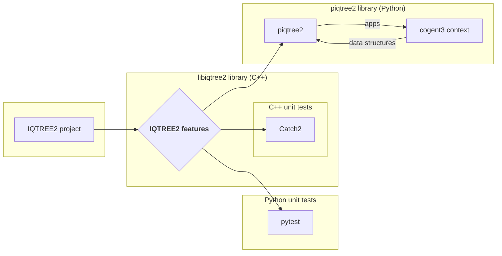

# libiqtree2

libiqtree2 is a C++ library for running IQ-TREE 2 from Python. It is a wrapper around the IQ-TREE 2 library, that exports IQTREE2 functions to C++ and python consumers - using pybind11 to map between C++ and python.

The library is built using CMake and the build process is managed by the root CMakeLists.txt file.

The library project includes C++ unit tests using Catch2 and Python unit tests using pytest.  The C++ tests are intended to be developed first as features are implemented, and then translated to Python tests to serve as a documentation for use case by python development of the piqtree2 python package.



The following document focuses on the libiqtree2 library and it's unit tests.  See the documentation in the piqtree2 directory for details on installing the python package, and developing it.

## Project structure

- /root
    - **CMakeLists.txt**  {root make file}
    - ... {various iqtree source subdirectories} 
    - /build
        - **libiqtree2.so**  {library binary}
        - /libiqtree2/tests/**libiqtree2_tests** {C++ unit test binary}
    - /libiqtree2
        - /include
            - **libiqtree2_functions.h**
        - /libs
            - **libiqtree2.so**  {last binary built is always copied here and used in python pytests}
            - **test_python.py** {a trivial python program that imports libiqtree2.so and returns the IQTREE2 version}
        - /src
            - **libiqtree2_bindings.cpp**  {describes the pybind11 bindings for the library}
            - /functions
                - **XXX_feature.cpp**   {a feature of IQTREE2 exposed by the library}
        - /tests
            - **CMakeLists.txt** {make file specifically for libiqtree2_tests target}
            - /C++
                - **test_XXX_feature.cpp**
            - /python
                - **test_XXX_feature.py**
    - /piqtree2 {Python package that uses cogent data structures, invokes libiqtree2 functions, and hosts cogent3 apps}
        - setup.py {package installation including building libiqtree2.so}
        - /piqtree2 {package source code}
            - **__init.py** {the main entry point for the piqtree2 module}
        - /tests
            - **test_XXX_feature.py**

## Build instructions

make sure you have the following installed
- cmake
- a c++ compiler
- Catch2 (a C++ unit test framework)
- Python 3

All of these can be installed using brew on MacOS or apt-get on Ubuntu.

Navigate to the root of your clone of piqtree2 (eg: ~/source/piqtree2);

```bash
    cd ~/source/piqtree2
```

Create a python virtual environment and install the required python packages into the environment;

```bash
    python3 -m venv venv
    source venv/bin/activate
    pip install pytest, pybind11, cogent3
```

Once built this virtual environment can always be reloaded with the command `source venv/bin/activate`.  Note if you are using VS-Code you should set the IDEs python interpreter to the one in the virtual environment.  If you are using Jupyter notebooks you should install the virtual environment as it's default kernel.

Create a new build subdirectry from the repo root if one does not already exist;

```bash
    mkdir build
    cd build
```

Run cmake on the CMakeLists.txt file in the repo root;

```bash
    cmake ..
```

Now make the C++ library without C++ unit tests;

```bash
    make libiqtree2
```

To make the library with C++ unit testing 

```bash
    make libiqtree2_tests
```

## Checking the library is importable in python

To check the library is importable in python run the test_python.py script in the libiqtree2/libs directory;

```bash
    cd ~/source/piqtree2/build/libiqtree2/libs
    python test_python.py
```
the result should look something like

```bash
import libiqtree2
imported libiqtree2
IQ-TREE multicore version 2.2.5 COVID-edition
```
## Running unit tests

To run tests you can execute the testing binary (libiqtree2_tests) directly or just run ctest in your build directory.  Note running the binary directly gives more information such as the count of tests expected to fail.

In a code/compile/test cycle you can run the C++ unit tests directly with the following commands:

```bash
    cd ~/source/piqtree2/build && make libiqtree2_tests && libiqtree2/tests/libiqtree2_tests
```

This results in a report of all failing tests like the following:

```bash
-------------------------------------------------------------------------------
generate_random_tree returns different results for different seeds
-------------------------------------------------------------------------------
/iqtree2/libiqtree2/tests/c++/src/test_generate_random_tree.cpp:28
...............................................................................

/iqtree2/libiqtree2/tests/c++/src/test_generate_random_tree.cpp:34: FAILED:
  REQUIRE( result1 != result2 )
with expansion:
  "((A,B),(C,D));" != "((A,B),(C,D));"
```

To run python tests you do not need to compile the tests with the libiqtree2_tests make target, but can use the libiqtree2 make target and just run pytest in the libiqtree2 source directory.

```bash
    cd ~/source/piqtree2/build && make libiqtree2 && pytest ../libiqtree2/tests/python
```

This results in a report of all failing tests like the following:

```bash
==================================================
test session starts
platform linux -- Python 3.11.2, 
pytest-8.0.1, pluggy-1.4.0
rootdir: /iqtree2
plugins: anyio-4.3.0
collected 12 items

../libiqtree2/tests/python/test_calculate_RF_distance.py .                              [  8%]
../libiqtree2/tests/python/test_generate_radom_tree.py ...xx.xxx                    [ 83%]
../libiqtree2/tests/python/test_phylogenic_analysis.py .                                  [ 91%]
../libiqtree2/tests/python/test_version.py .                                                       [100%]
==================================================
7 passed, 5 xfailed in 1.74s
```

## Development cycle

- C++
  - identify a feature of IQTREE2 to be exposed in libiqtree2 eg: generate_random_tree
  - implement feature
    - add C++ code to invoke the feature as a function eg: libiqtree2/src/generate_random_tree.cpp
    - add link libraries and interfaces to the root CMakeLists.txt file so you can  compile the feature in the target `libiqtree2`
    - describe the interface to the function in libiqtree2/include/libiqtree2_functions.h
    - add a binding for the function in libiqtree2/src/libiqtree2_binding.cpp
  - create a Catch2 test for the feature eg: libiqtree2/tests/c++/src/test_generate_random_tree.cpp
    - add test cases to the test that probe the expected behaviour of the feature
  - iterate on the feature and re-test until all tests pass
- Python
  - translate the C++ test cases to a python test for the feature eg: libiqtree2/tests/python/test_generate_random_tree.py
  - these will form a contract for the feature for the piqtree2 package
