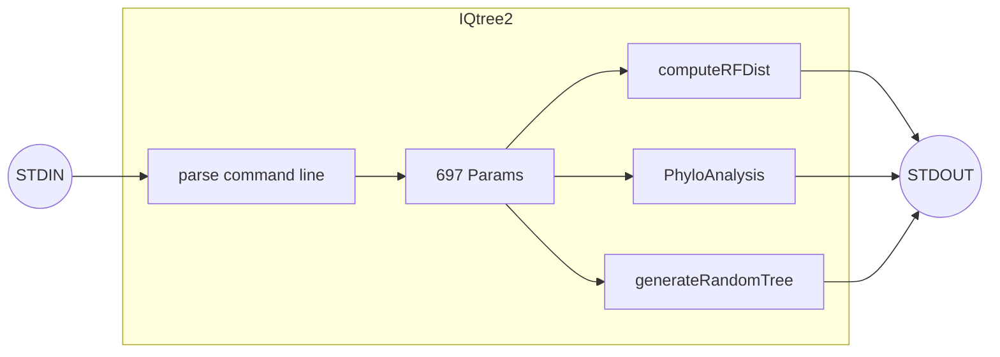
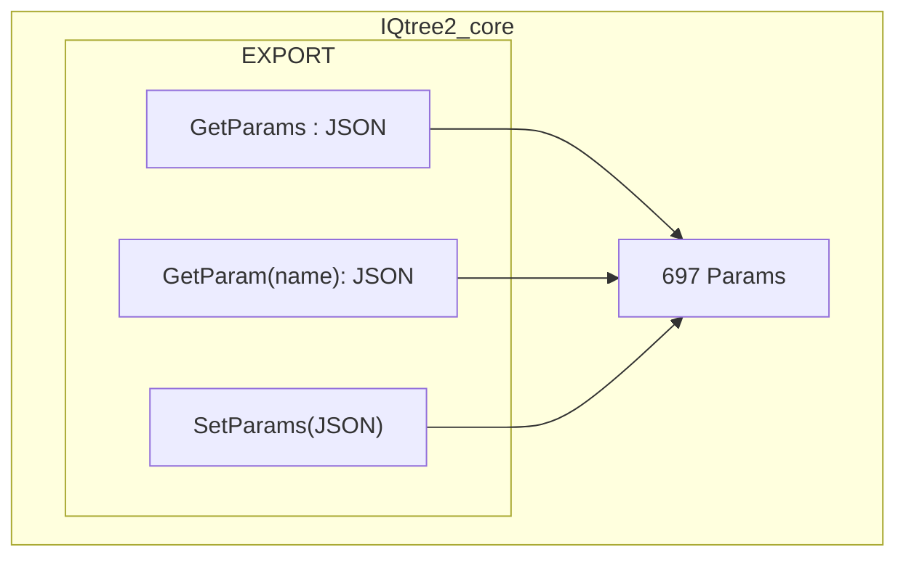
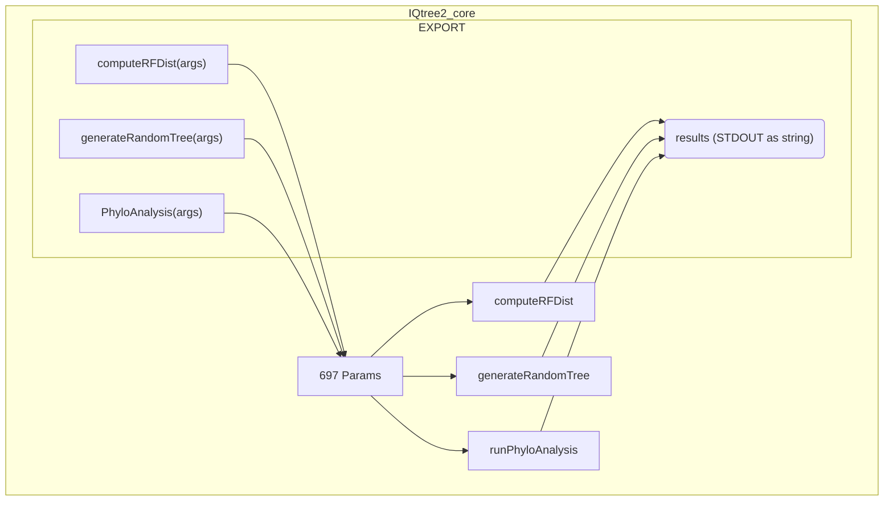

# PiQTree2 - a Python wrapper around IQTest2 (https://github.com/iqtree/iqtree2)

## IQTree2

IQTree2 can be summarized as a C++ binary executable that contains a singleton named `Params` (in utils/tools.h) with 697 member variables in about 3000 thousand lines of code.  The main function parses command-line arguments and populates the Params singleton, then calls a function (like runPhyloAnalysis(Params) in phyloanalysis.cpp or 16 other functions) to run the specific analysis.



## iqtree2_core

iqtree2_core is a C++ library that implements the IQTree2 codebase.  

### Export Params interface from iqtree2_core

The library includes functions for getting and setting the 679 member variables of the Params singleton.




This is implemented by extending the IQTree2 Params singleton with the following functions using the C++ library [https://github.com/nlohmann/json](https://github.com/nlohmann/json)

```c
#include "json.hpp"
using json = nlohmann::json;

class Params {
public:
   // ...
    json to_json() const;
    void from_json(const json& j);
    json get_param(const std::string& name) const;
  //...
};

json Params::to_json() const {
    json j;
    j["fai"] = fai;   // this is required for each member variable of Params 
    // ... 
    return j;
}

void Params::from_json(const json& j) {
    if (j.contains("fai")) { // this is required for each member variable of Params 
        fai = j["fai"].get<bool>();  
    }
    // ... 
}

json Params::get_param(const std::string& name) const {
    json j;
    if (name == "fai") {  // this is required for each member variable of Params
        j[name] = fai;
    }
    // ... 
    else {
        throw std::invalid_argument("Unknown parameter name");
    }
    return j;
}
```
The library then exports the following functions:

- <details><summary>getParams():JSON string of the Params singleton</summary>
  <pre>

  ```c
      const char* get_params() {
          Params& params = Params::getInstance();
          json j = params.to_json();
          return j.dump().c_str();  // Convert JSON to string and return
      }
  ```
  </pre>
  </details>
- <details open><summary>setParams():set the Params singleton from a JSON string</summary>
  <pre>

  ```c
      void set_params(const char* json_str) {
          Params& params = Params::getInstance();
          json j = json::parse(json_str);  // Parse JSON string
          params.from_json(j);  // Update Params with JSON data
      }
  ``` 
  </pre>
  </details>
- <details><summary>get_param(name):get the JSON representation of a specific parameter from the Params singleton</summary>
  <pre>

  ```c
      char* get_param(const char* name) {
          try {
              Params& params = Params::getInstance();
              json j = params.get_param(name);
              std::string str = j.dump();
              char* cstr = new char[str.length() + 1];
              std::strcpy(cstr, str.c_str());
              return cstr;  // Caller is responsible for deleting this memory
          } catch (const std::exception& e) {
              // Handle error 
              return NULL;
          }
      }
  ```
  </pre>
  </details>


### Export terminal functions from iqtree2_core

The library exports the 17 main functions of IQTree2:
- <details><summary><strong>computeRFDist()</strong>:compute the Robinson-Foulds distance between two trees</summary> 
  <pre>

  ```c
  EXPORT const char* RF_distance_calculation(const char* tree1_file, const char* tree2_file);
  ```
  [https://github.com/cogent3/PiQTree2/issues/4]
  </pre>
  </details>
- <details><summary><strong>generateRandomTree()</strong>:generate a random tree</summary>
  <pre>

  ```c
      EXPORT const char* random_tree_generation(int num_taxa, const char* branch_length_mode);
  ```
  [https://github.com/cogent3/PiQTree2/issues/6]
  </pre>  
  </details>
- <details><summary><strong>runPhyloAnalysis()</strong>:run a phylogenetic analysis</summary>
  <pre>

  ```c
    EXPORT const char* phylogenetic_analysis(
        const char* aln_file, 
        const char* partition_file, 
        const char* tree_file 
    );
  ```
  </pre>
  [https://github.com/cogent3/PiQTree2/issues/5]
  </details>
- Input File Testing: Tests the specified input file to ensure it meets the necessary format and requirements.
- Print Taxa: Outputs the taxa information contained in the specified tree file.
- Parsimony Multistate: Performs a parsimony analysis on multistate data provided in the input file.
- Print Area: Outputs the area information contained in the specified tree file.
- Scale Branch Length: Scales the branch lengths in the specified tree file by a given factor.
- PD Distribution: Computes the Phylogenetic Diversity (PD) distribution for the given tree file and taxa sets.
- Branch Statistics: Outputs statistics of the branches contained in the specified tree file.
- Tree Clustering: Clusters the trees in the specified file based on a given clustering threshold.
- NCBI Tree Processing: Processes the tree based on the NCBI taxonomy IDs provided in the input file.
- ECO PD Analysis: Performs ECO Phylogenetic Diversity (PD) analysis using the tree file and the ECO Directed Acyclic Graph (DAG) file.
- All NNI Trees: Outputs all possible Nearest Neighbor Interchange (NNI) trees for the given tree file.
- Guided Bootstrap: Performs a guided bootstrap analysis using the tree file and site log-likelihood file.
- Multiple Probabilities Calculation: Calculates multiple probabilities using the tree file and a second alignment file.



### Consumers of iqtree2_core

The library is consumed by the following consumers:
- <details><summary><strong>PyQtree2_CLI</strong> Click based CLI python application</summary>
  <pre>

  ```mermaid
  graph LR;
    subgraph pyqtree[PiQTree2]
      direction LR
      subgraph function2[computeRFDist]
        direction LR
        call2["computeRFDist"]
        results2[computeRFDist results]
        call2--"iqtree2_core"-->results2
      end
      subgraph function3[generateRandomTree]
        direction LR
        call3["generateRandomTree"]
        results3[generateRandomTree results]
        call3--"iqtree2_core"-->results3
      end
      subgraph function1[PhyloAnalysis]
        direction LR
        call1["runPhyloAnalysis"]
        results1[runPhyloAnalysis results]
        call1--"iqtree2_core"-->results1
      end
    end
    subgraph PiQTree2_CLI
      direction LR
      args{click}
      args-.->call2
      args-.->call3
      args-.->call1
      results2-.->results
      results3-.->results
      results1-.->results
    end
    STDIN((STDIN))-->args 
    results-->STDOUT((STDOUT))
  ```

  </pre>
  </details>
- <details><summary><strong>PiQTree2_plugin</strong> Pluggy based plugin for cogent3</summary>
  <pre>

  ```mermaid
  graph LR;
    subgraph pyqtree[pyqtree]
      direction LR
      subgraph function2[computeRFDist]
        direction LR
        call2["computeRFDist(args2)"]
        results2[computeRFDist results]
        call2--"iqtree2_core"-->results2
      end
      subgraph function3[generateRandomTree]
        direction LR
        call3["generateRandomTree(args3)"]
        results3[generateRandomTree results]
        call3--"iqtree2_core"-->results3
      end
      subgraph function1[PhyloAnalysis]
        direction LR
        call1["runPhyloAnalysis(args1)"]
        results1[runPhyloAnalysis results]
        call1--"iqtree2_core"-->results1
      end
    end
    subgraph D[cogent3]
      direction LR
      plugin1-->pluginhost
      plugin2-->pluginhost
      pyqtreeplugin-->pluginhost
      subgraph pyqtreeplugin[pyqtreeplugin]
        direction LR
        func2[computeRFDist]-.->call2[computeRFDist]
        func3[generateRandomTree]-.->call3[generateRandomTree]
        func1[PhyloAnalysis]-.->call1[runPhyloAnalysis]
      end
    end
  ```
  </pre>
  </details>
- <details><summary><strong>pytest</strong> pytest tests</summary>
    <pre>

    ```mermaid
  graph LR;
    subgraph pyqtree[pyqtree]
      direction LR
      subgraph function1[PhyloAnalysis]
        direction LR
        call1["runPhyloAnalysis(args1)"]
        results1[runPhyloAnalysis results]
        call1--"iqtree2_core"-->results1
      end
      subgraph function2[computeRFDist]
        direction LR
        call2["computeRFDist(args2)"]
        results2[computeRFDist results]
        call2--"iqtree2_core"-->results2
      end
      subgraph function3[generateRandomTree]
        direction LR
        call3["generateRandomTree(args3)"]
        results3[generateRandomTree results]
        call3--"iqtree2_core"-->results3
      end
    end
    subgraph tests[tests]
      direction LR
      test1[test_runPhyloAnalysis]
      test2[test_computeRFDist]
      test3[test_generateRandomTree]
    end
    test1-.->call1
    test2-.->call2
    test3-.->call3
    pytest((pytest))-->tests
    ```
    </pre>
    </details>