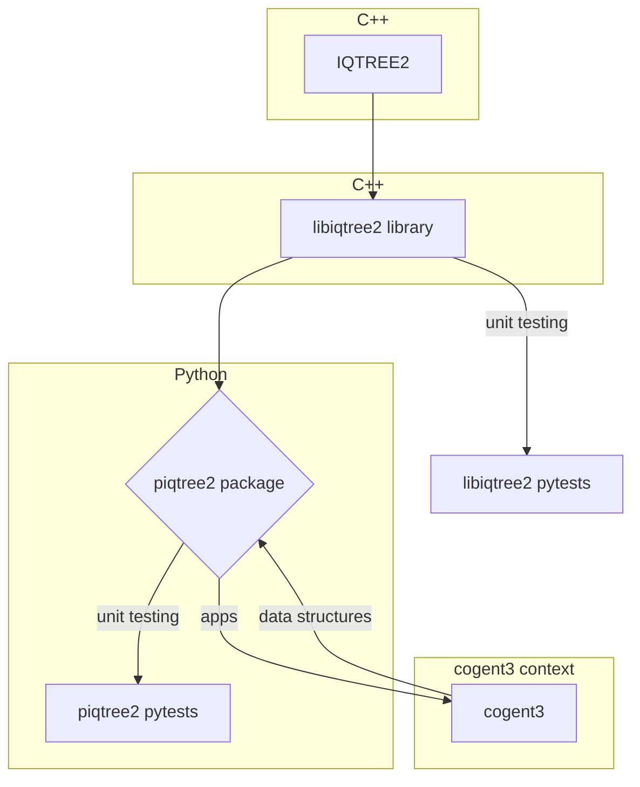

# piqtree2

piqtree2 is a Python library that uses the libiqtree2 C++ library to run IQ-TREE 2 from Python. It uses the cogent3 library for data structures, and it hosts cogent3 apps and makes them available for cogent3 workflows.



## Project structure

- /piqtree2
    - setup.py {package installation including building libiqtree2.so}
    - /libs {C++ library and tests}
        - **libiqtree2.so**  {last binary built is always copied here and used in python pytests}
        - **libiqtree2_version.py** {a trivial python program that imports libiqtree2.so and returns the IQTREE2 version}
    - /piqtree2 {package source code}
        - `__init.py` {the main entry point for the piqtree2 module}
    - /tests
        - `test_XXX_feature.py`

## Installation

To install the piqtree2 package, navigate to the  `/piqtree2` directory and run:

`pip install .`

To install the package in editable mode for development, run:

`pip install -e .`

## Build instructions

The python package installer will automatically build the libiqtree2.so library and copy it to the `piqtree2/libs` directory.  The library is built using the CMakeLists.txt file in the root directory using the libiqtree2 target.

If you are editing the libiqtree2 library, you can build it manually by running: 
```bash
cd ~/piqtree2/build && cmake .. && make libiqtree2
```
Which will also automatically copy the latest build of the library to the `piqtree2/libs` directory.

After making changes to libiqtree2 run the piqtree2 unit tests to ensure that the changes have not broken the Python interface.

## Running unit tests

To run the Python unit tests, run:

`pytest tests`

This will run all the test cases in the `tests` subdirectory and provide a report of any failing tests.

## Development cycle

- Identify a feature of IQ-TREE 2 to be exposed in piqtree2.
- implement the new feature in the libiqtree2 library (see libiqtree2 development cycle).
- run the piqtree2 unit tests to ensure that the change has not broken any existing contracts.
- Implement the new feature in the `piqtree2/piqtree2` directory using data structures from the cogent3 package.
- Create a Python test for the feature in the `piqtree2/tests` directory.
- Iterate on the feature and re-test until all tests pass.