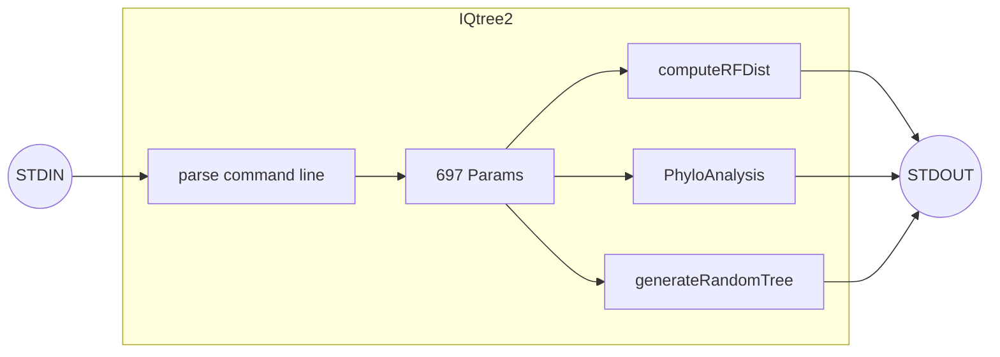

# pyqtest2 - a Python wrapper around IQTest2 (https://github.com/iqtree/iqtree2)

## IQTree2

IQTree2 can be summarized as a C++ binary executable that contains a singleton named `Params` (in utils/tools.h) with 697 member variables in about 3000 thousand lines of code.  The main function parses command-line arguments and populates the Params singleton, then calls a function (like runPhyloAnalysis(Params) in phyloanalysis.cpp or 16 other functions) to run the specific analysis.

## iqtree2_core

iqtree2_core is a C++ library that implements the IQTree2 codebase.  

The library includes functions for getting and setting the 679 member variables of the Params singleton.
- getParams():JSON string of the Params singleton
- setParams():set the Params singleton from a JSON string
- getParam(name):get the JSON representation of a specific parameter from the Params singleton

The library exports the 17 main functions of IQTree2:
- Random Tree Generation: Generates a random tree given the number of taxa and the mode for generating branch lengths.
- Parsimony Multistate: Performs a parsimony analysis on multistate data provided in the input file.
- RF Distance Calculation: Calculates the Robinson-Foulds distance between two phylogenetic trees specified in the input files.
- Input File Testing: Tests the specified input file to ensure it meets the necessary format and requirements.
- Print Taxa: Outputs the taxa information contained in the specified tree file.
- Print Area: Outputs the area information contained in the specified tree file.
- Scale Branch Length: Scales the branch lengths in the specified tree file by a given factor.
- PD Distribution: Computes the Phylogenetic Diversity (PD) distribution for the given tree file and taxa sets.
- Branch Statistics: Outputs statistics of the branches contained in the specified tree file.
- Tree Clustering: Clusters the trees in the specified file based on a given clustering threshold.
- NCBI Tree Processing: Processes the tree based on the NCBI taxonomy IDs provided in the input file.
- ECO PD Analysis: Performs ECO Phylogenetic Diversity (PD) analysis using the tree file and the ECO Directed Acyclic Graph (DAG) file.
- All NNI Trees: Outputs all possible Nearest Neighbor Interchange (NNI) trees for the given tree file.
- Guided Bootstrap: Performs a guided bootstrap analysis using the tree file and site log-likelihood file.
- Multiple Probabilities Calculation: Calculates multiple probabilities using the tree file and a second alignment file.
